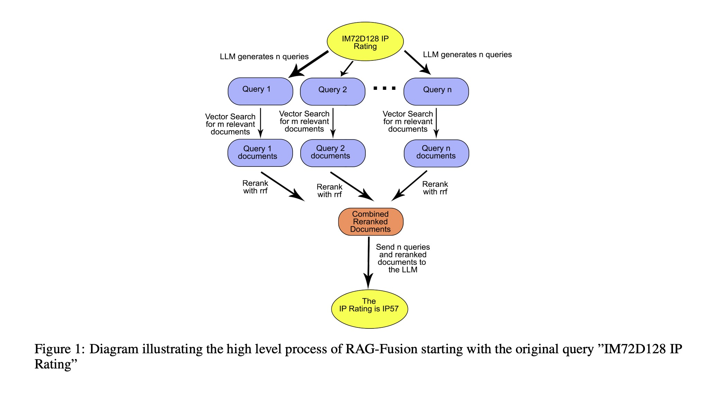
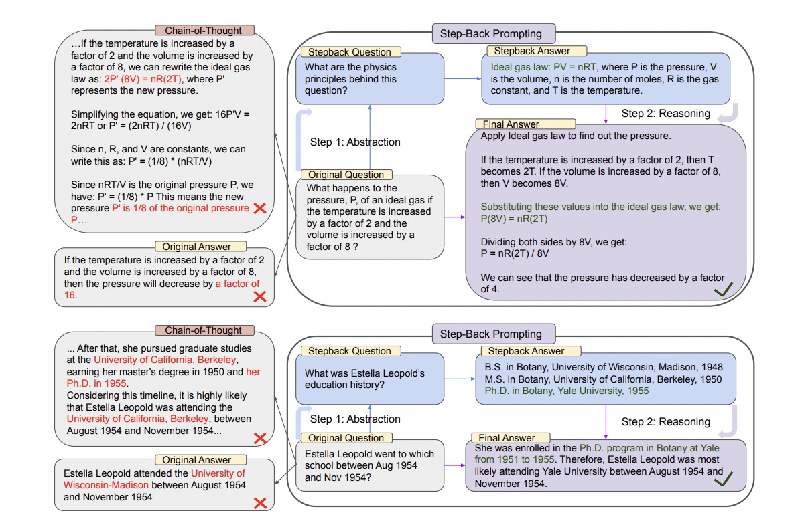
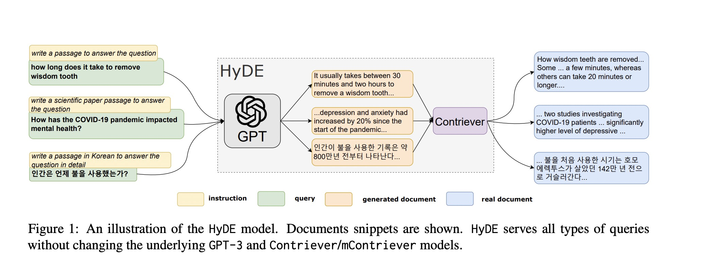

# Langchain and Langraph

#### Every week I spend some time learning new concepts and latest trends in applied GenAI and get hands on. I then use these learnings to solve real life customer problems at work. This repo. is all about Langchain, Langgraph, Agentic AI etc. Goal is to break down different components of a RAG pipeline and how each component can be optimized. I cover different techniques to optimize these components covered in Langchain docs, blogs or external sources. 

I have tried to give credits where required. Incase I missed it, its not intentional.

## RAG Landscape

### Query Translation (Multi Query Retrieval)

#### Source : https://python.langchain.com/v0.2/docs/concepts/

### 1. Multi Query Retrieval

### 2. Query Translation - RAG Fusion Retrieval (Rerank retrieved documents based on RRF algorithm (Reciprocal Rank Fusion))

#### Source : https://arxiv.org/abs/2402.03367

### 3. Query Translation (Query Decomposition)

#### Source : https://github.com/langchain-ai/rag-from-scratch/blob/main/rag_from_scratch_5_to_9.ipynb

##### Answer current question using retrieval and any previous Q & A stored in memory

### 4. Query Translation (Step Back Prompting)

#### Source : https://github.com/langchain-ai/rag-from-scratch/blob/main/rag_from_scratch_5_to_9.ipynb , https://arxiv.org/pdf/2310.06117

##### Ask model to step back and generate a question asking about more abstract/high level concepts. Pass that as additional context along with the context retrieved for actual customer query

### 5. Query Translation (HyDE - Hypothetical Document Embeddings)

#### Source : https://github.com/langchain-ai/rag-from-scratch/blob/main/rag_from_scratch_5_to_9.ipynb , https://arxiv.org/pdf/2212.10496

#### 
1. HyDE is an embedding technique that takes queries, generates a hypothetical answer, and then embeds that generated document and uses that as the final example.
2. Ask the LLM to write a paragraph/paper for the user query (expand on that from LLM parametric knowledge)
3. Embedd that paragraph
4. Compare the paragraph to other embeddings in same space and retrieve most similar matches
5. Feed these matches to final context to generate final response

#### Idea is that expanded paragraph from user query if embedded in the same space will capture context and key information related to user query. So its better to embedd this and use it for retrieval than just using user query

