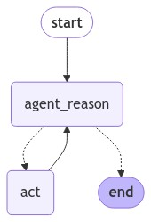

### ReAct agent using Langgraph 

Prompt used : hwchase17/react

ReAct implementation is much easier with Langgraph as compared to Langchain.

ReAct is a first generation agent. This field is rapidly changing and ReAct agents are are today known to be hard to use and there is no clear defined path/set of paths that agent can take. We are now moving to second generation agents. More details can be found here : https://towardsdatascience.com/navigating-the-new-types-of-llm-agents-and-architectures-309382ce9f88

Although more advanced techniques are coming up but I believe ReAct paper laid the foundation for many of those advanced techniques

### Langgraph for this ReAct agent

