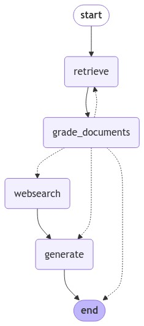
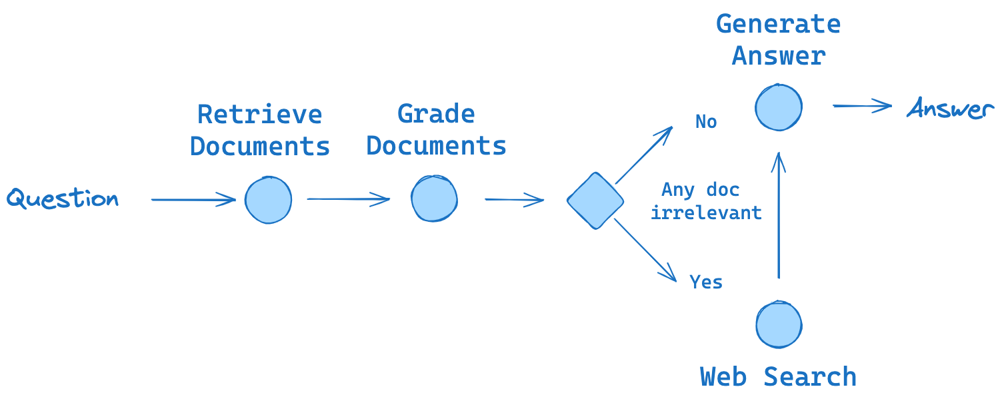

## Corrective RAG

#### Main Idea :

1. Retrieve the documents
2. Ask LLM to grade the retrieved documents and tell us which documents are relevent to user question. We filter out irrelevant docs **(We Correct our retrieval)**
3. For relevant docs, we feeed them as context to LLM to generate final answer
4. If there are some irrelevant docs, then we trigger web search to get additional context that is fed to LLM as context along with relevant docs

#### Corrective RAG Graph from Langgraph

#### Corrective RAG Flow

