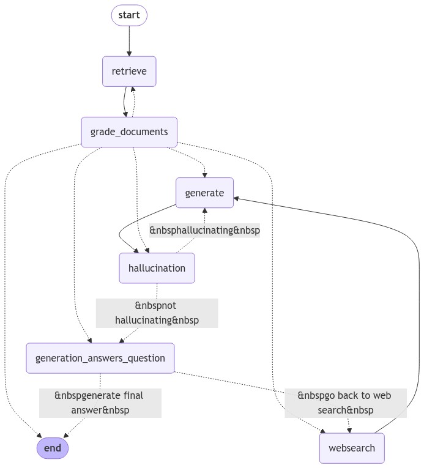

## Self RAG

#### Main Idea :

1. Retrieve the documents
2. Ask LLM to grade the retrieved documents and tell us which documents are relevent to user question. We filter out irrelevant docs **(We Correct our retrieval)**
3. For relevant docs, we feeed them as context to LLM to generate final answer
4. If there are some irrelevant docs, then we trigger web search to get additional context that is fed to LLM as context along with relevant docs
5. After final answer has been generated, we check for hallucination. We ask LLM to check if generated response is grounded in provided context. If yes then we move to next step where check if generated answer actually answers users query. If LLM says no that means our model is hallucinating, so we generate response again.
6. If no hallucination, then we ask LLM to check if generated response actually answers user question. If yes, then we end the flow. If not, then flow again goes to web_search node and then -> hallucination check -> answer question check and repeat
   

#### Self RAG Graph from Langgraph

#### Self RAG Flow

